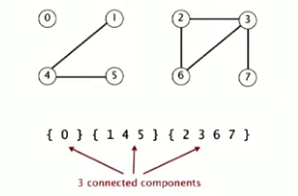
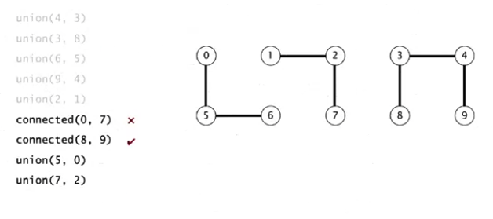
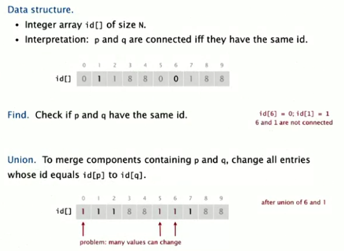
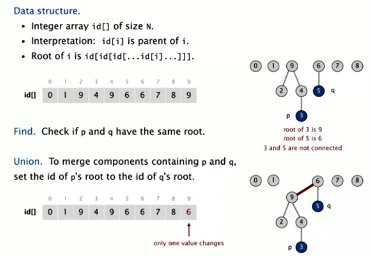

# Disjoint-Set/Union-Find Data Structure

> _Note: All illustrations below are from the Algorithms, Part I course on [Coursera](https://www.coursera.org/learn/algorithms-part1). I plan to circle back and provide my own implementations of the structures/algorithms covered in this series at a later date._

A _disjoint-set_ (also referred to as a _union-find_ data structure) is a data structure that tracks a set of elements partitioned into a group of disjoint subsets (_connected components_)

**Dynamic Connectivity**

- A dynamic connectivity structure maintains information about the connected components of a graph.
- Given a set of _N_ objects:
  - Connect two objects (**_Union_ command**)
  - Determine if there is a path connecting two objects (**_Find_ query**)

**Quick Find**

- _Eager_ algorithm used to solve the [dynamic connectivity](#DynamicConnectivity) problem.
- _Find_ is a very efficient command in this algorithm as it is in constant time.
  - Given id[] of size _N_, check if _p_ and _q_ are connected:
  - `id[p] === id[q]`
- _Union_ is measured in quadratic time as the time to solve is dependent on the size of the array and the number of values that must change as a result.
  - When changing a value of `id[q]`, you much change all entries who value is equal (connected) to `id[q]` as well.

**Quick Union**

- _Lazy_ algorithm used to solve the [dynamic connectivity](#DynamicConnectivity) problem.
- Data structures implementing this algorithm are represented as trees in order to find the connected root of each element.
- _Find_ requires a traversal up the tree:
  - Given id[] of size _N_, check if _p_ and _q_ have the same root
  - `return root(p) === root(q)`
- _Union_ requires the _find_ method in order to determine each element's root and is measured in linear time:
  - To merge _connected components_ containing _p_ and _q_, set
    the id of _p_'s root to the id of _q_'s root.

