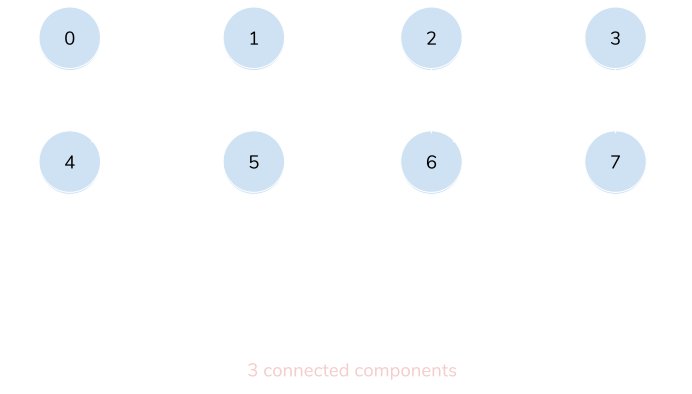
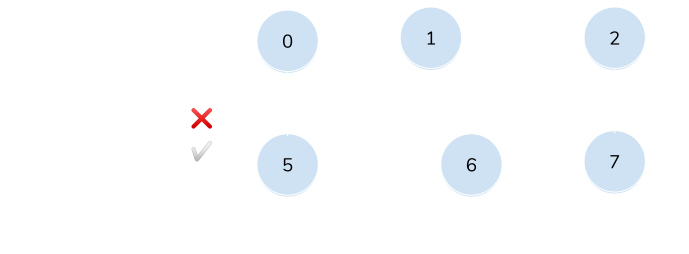
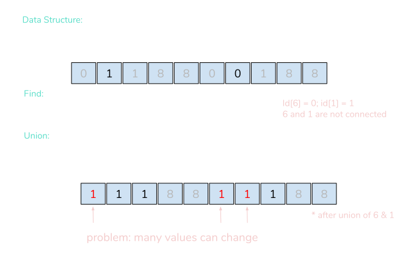
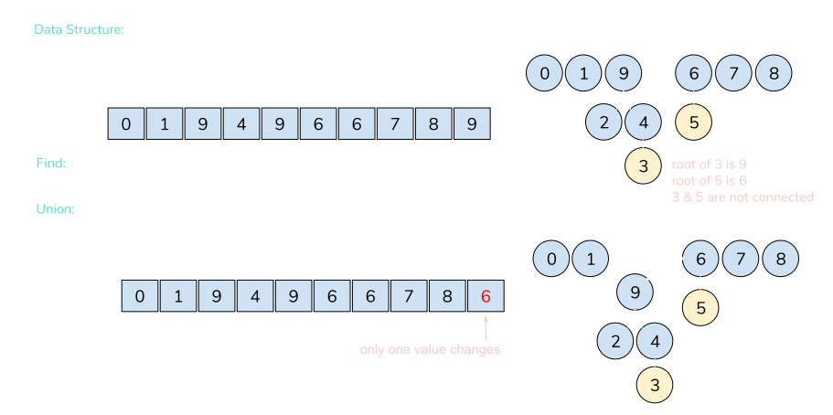

> _Note: This post is part of the Data Structures and Algorithm series. To see more posts from this series, [click here](/series/data-structures-and-algorithms). The illustrations below are inspired by the Algorithms, Part I course on [Coursera](https://www.coursera.org/learn/algorithms-part1). All code examples from this series can be found [here](https://github.com/thefrugaldev/data-structures-and-algorithms)._

A [**_disjoint-set_**](https://en.wikipedia.org/wiki/Disjoint-set_data_structure) (also referred to as a _union-find_ data structure) is a data structure that tracks a set of elements partitioned into a group of disjoint subsets (also known as [_connected components_](<https://en.wikipedia.org/wiki/Component_(graph_theory)>)). Given this type of data structure, there are multiple algorithms that can be used to solve the two major equations for a disjoint-set, the **_Union_** command and the **_Find_** query, which we'll go into more detail below.



## **Dynamic Connectivity**

- A dynamic connectivity structure maintains information about the connected components of a graph.
- Given a set of _N_ objects:
  - Connect two objects (the **_Union_** command)
  - Determine if there is a path connecting the two objects (the **_Find_** query)

### Union-Find Illustration



## **Quick Find**

- Quick Find is an [_Eager_ algorithm](https://en.wikipedia.org/wiki/Eager_evaluation) also used to solve the _dynamic connectivity_ problem.
- The **_Find_** query for this algorithm is very efficient and is measured in [constant time](https://en.wikipedia.org/wiki/Time_complexity#Constant_time).
  - Given id[] of size _N_, check if _p_ and _q_ are connected.
- The **_Union_** command is measured in quadratic time because the time to resolve is dependent on the size of the array and the number of values that must change as a result.
  - When changing a value of `id[q]`, you must also change all entries whose value is equal (connected) to `id[q]` as well.

### Quick Find Illustration



### Implementation of Quick Find

```typescript
import DisjointSet from "./DisjointSet"

class QuickFind implements DisjointSet {
  disjointSet: number[]

  constructor(quantity: number) {
    this.disjointSet = []

    for (let i = 0; i < quantity; i++) this.disjointSet[i] = i
  }

  find = (p: number, q: number): boolean => {
    return this.disjointSet[p] === this.disjointSet[q]
  }

  union = (p: number, q: number): void => {
    const pid = this.disjointSet[p]
    const qid = this.disjointSet[q]

    this.disjointSet.forEach((value, index) => {
      if (value === pid) {
        this.disjointSet[index] = qid
      }
    })
  }
}

export default QuickFind
```

## **Quick Union**

- Quick Union is a [_Lazy_ algorithm](https://en.wikipedia.org/wiki/Lazy_evaluation) that, again, is used to solve the _dynamic connectivity_ problem.
- Data structures implementing this algorithm are represented as [trees](<https://en.wikipedia.org/wiki/Tree_(graph_theory)>) in order to find the connected root of each element.
- The **_Find_** query requires a traversal up the tree:
  - Given id[] of size _N_, check if _p_ and _q_ have the same _root_.
- The **_Union_** command requires the _find_ query in order to determine each element's root before merging.
  - This command is measured in [linear time](https://en.wikipedia.org/wiki/Time_complexity#Linear_time) because in order to merge the _connected components_ containing _p_ and _q_, we must set the id of _p_'s root to the id of _q_'s root.

### Quick Union Illustration



### Quick Union Implementation

```typescript
import DisjointSet from "./DisjointSet"

class QuickUnion implements DisjointSet {
  disjointSet: number[]

  constructor(quantity: number) {
    this.disjointSet = []

    for (let i = 0; i < quantity; i++) this.disjointSet[i] = i
  }

  private root(valueToCheck: number) {
    while (this.disjointSet[valueToCheck] !== valueToCheck) {
      valueToCheck = this.disjointSet[valueToCheck]
    }

    return valueToCheck
  }

  private isDirectChild(p: number, q: number) {
    return this.disjointSet[p] === this.disjointSet[q]
  }

  find(p: number, q: number): boolean {
    if (this.isDirectChild(p, q)) return true

    return this.root(p) === this.root(q)
  }

  union(p: number, q: number): void {
    const rootP = this.root(p)
    const rootQ = this.root(q)

    this.disjointSet[rootP] = rootQ
  }
}

export default QuickUnion
```
