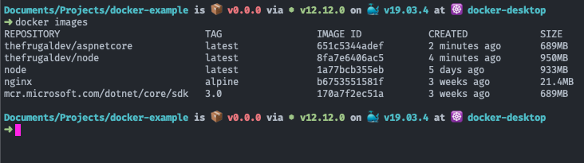

I recently began playing around with Docker in my spare time. I've heard a lot about the benefits of containerizing applications but, being an avid practitioner of [pain driven development](https://www.weeklydevtips.com/episodes/010), I haven't found the need to implement it in any of my applications thus far. Curiosity got the better of me, however, and so I decided to list out a quick reference guide for common commands used within the Docker CLI. A [complete list of these commands](https://docs.docker.com/engine/reference/commandline/cli/) are readily available on Docker's documentation site, but feel free to follow along in your terminal after [downloading Docker Desktop](https://hub.docker.com/?overlay=onboarding).

## Getting Started

The easiest way to get started from the command line, and typically one of the first commands I run when starting out with a new CLI, is the **_help_** command.

`docker help` -- list of commands to use with docker

The help command will give you a list of available commands within the Docker CLI.

## Images

In Docker, an _image_ is a set of instructions or commands used to create a _container_ (more of those later). It is immutable in nature, so once an image is built, it must either be re-created or deleted, using a new set of instructions. The instructions that Docker images are built from are known as [Dockerfiles](https://docs.docker.com/engine/reference/builder/).

In order to build these images, a simple command can be used in your terminal:

`docker build -f {DOCKER_FILE_NAME} -t {IMAGE_TAG} .` --build docker image (specify params)

In the code above, `docker build` is executed with a couple of arguments to build a Docker _image_. The first argument specifies which Dockerfile to use to build the image, and the second argument specifies the tag, or name, of the image that you are building. So, the above command could look something like this:

- `docker build -f node.dockerfile -t thefrugaldev/node .`

Once you've got a few images created, you can list them out using the following command:

`docker images`

This will list out all top level images, including properties such as their tag, the date they were created, the size, and their image id. The output in your terminal should look something like this, after execution.

If you find that you have too many images or decide you don't need a specific image anymore, you can always remove a specific image by providing the image id as an argument to the following command.

`docker rmi {IMAGE ID}`

## Containers

Containers are probably what brought you to Docker in the first place. The word gets thrown around a lot when mentioning Docker, but what is a container? From a high level, a container is similar to an image, but its state can change and is built at runtime. Containers, unlike images, have a writable persistence layer, that can be added to or modified. When a container is deleted, so too is this persistence layer. So, in this sense, multiple containers can share a single image, and still have an isolated persistence layer.

To run a container, simply specify which image you want to run. The terminal will then return the container id of the newly created container.

`docker run -d thefrugaldev/node`

There are quite a few arguments that you can pass to the previous command:

`docker run -d --net {NETWORK} --name {CONTAINER_ALIAS} -p {INTERNAL_PORT:EXTERNAL_PORT} {IMAGE_TO_RUN}`

By specifying `-d` you are telling Docker to run in detach, or background, mode. In Docker, you can set up an isolated network with the `--net` argument, and containers within that network can communicate with each other.

EXAMPLE

- `docker run -d --net=isolated_network --name nodeapp -p 3000:3000 cormandev/node`

`docker exec {CONTAINER_NAME} {CMD}`

EXAMPLE

- `docker exec nodeapp node dbSeeder.js`

`docker ps` -- list all running containers
`docker ps -a` -- list any containers (running or otherwise)
`docker rm {CONTAINER_ID}`
`docker rm -f $(docker ps -a -q)` -- remove all containers [-f force, $() eval, -q quiet]

## Volumes - define

For larger write operations, containers can have **_volumes_** associated with them as well.

`docker volume prune` --removes any volumes not currently being used by containers

## Docker Compose - define

`docker-compose build`
`docker-compose up -d`
`docker-compose down --rmi all --volumes`
`docker-compose logs` -- good if you run in daemon mode
`docker-compose ps`
`docker-compose start`
`docker-compose stop`
`docker-compose rm`

## Extensions

Show screen grab
